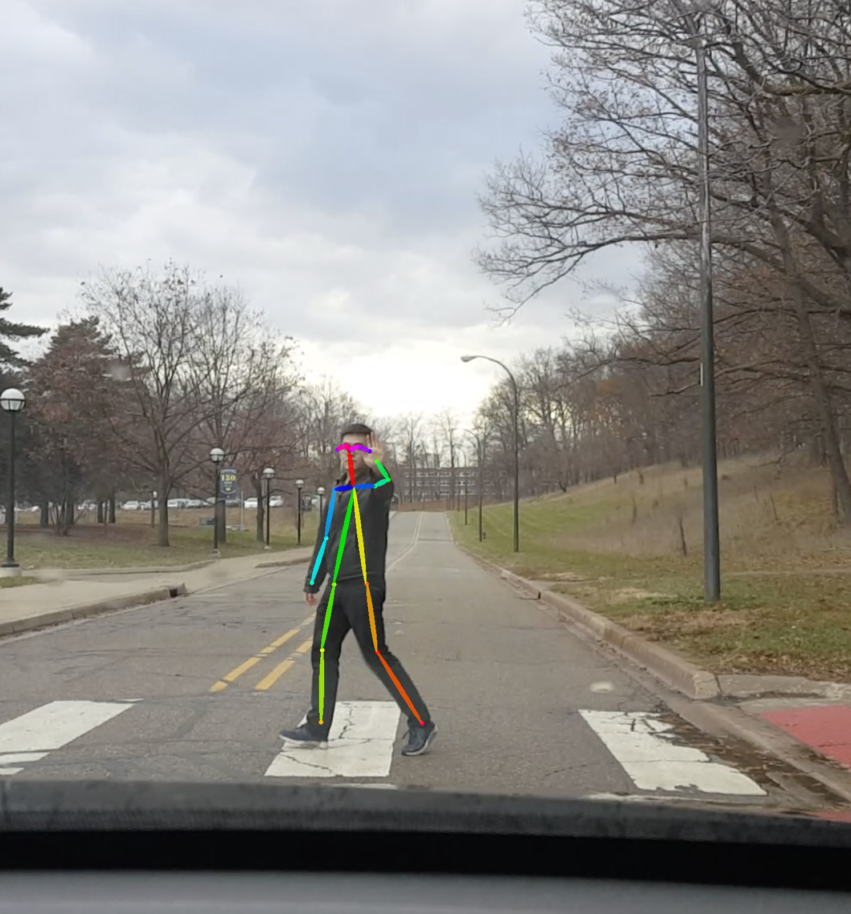
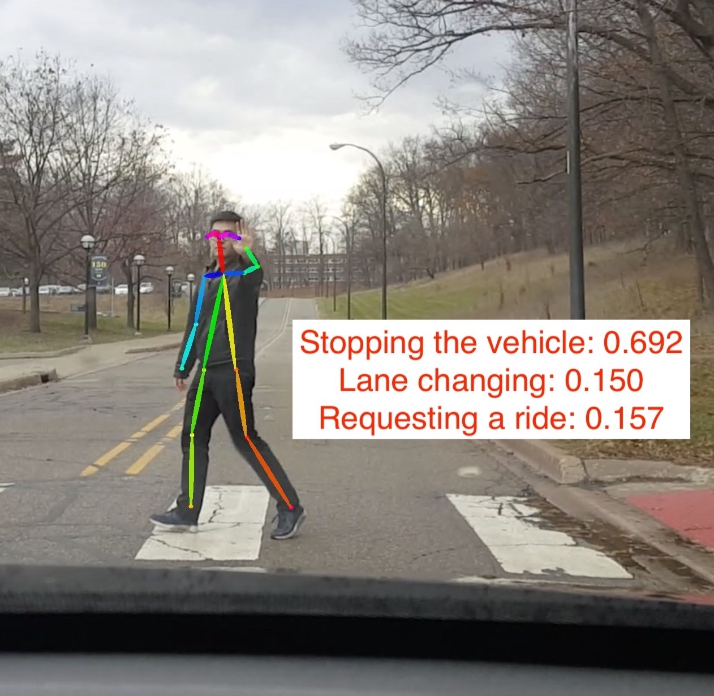

# EECS504 Final Project: Human Gesture Recognition Through Skeleton Estimation
## Overview
we proposed a vision-based explicit method that calculated the probability distribution of human intentions through gesture recognition for autonomous vehicles. The method utilizes a human skeleton estimation model to find the locations of the human skeleton key points, and constructs a feature vector to represent the human gesture based on the estimated human skeleton key points. A gesture recognition model is further deployed to obtain the human intention probability distribution with feature vectors as the inputs.

The human skeleton estimation is following this [CVPR paper](https://arxiv.org/abs/1611.08050).

The original repo can be found [here](https://github.com/ZheC/Realtime_Multi-Person_Pose_Estimation)

## Pipe-Line
1. Human Skeleton Estimation Model Implementation and Training (90% of our total workload)
2. Gesture Recognition Model Implementation and Training (10% of our total work)

## Human Skeleton Estimation Model Implementation and Training
### Data Set

* Option 1: Download a small sample training set saved by us from this [LINK](https://github.com/cocodataset/cocoapi)
* Option 2: Download the COCO data set (65GB) and API following this [REPO](https://github.com/cocodataset/cocoapi)

### Training Procedure
1. Download the training data, put training data in data folder
2. cd skeleton_estimation_train
3. python3 train_model_main.py
4. Without pre-trained weights, set RETRAIN = 0

### Result

##  Gesture Recognition Model Implementation and Training

#### We want to point out that our work is focusing on the Human Skeleton Estimation Model Implementation, and Gesture Recognition is an application that uses the detected human skeleton, which is not our focus in this project.

### Data Set
We can not find a free and public data set that fit out requirement, we manually labeled 1000 images that contain three most common human intentions: pedestrian stopping the vehicle, pedestrian requesting a ride and biker indicating the lane changing, to test the gesture recognition concept. 
1. Install jupyter notebook
2. cd gesture_train
3. run gesture_recognition_train.ipynb

### Result

